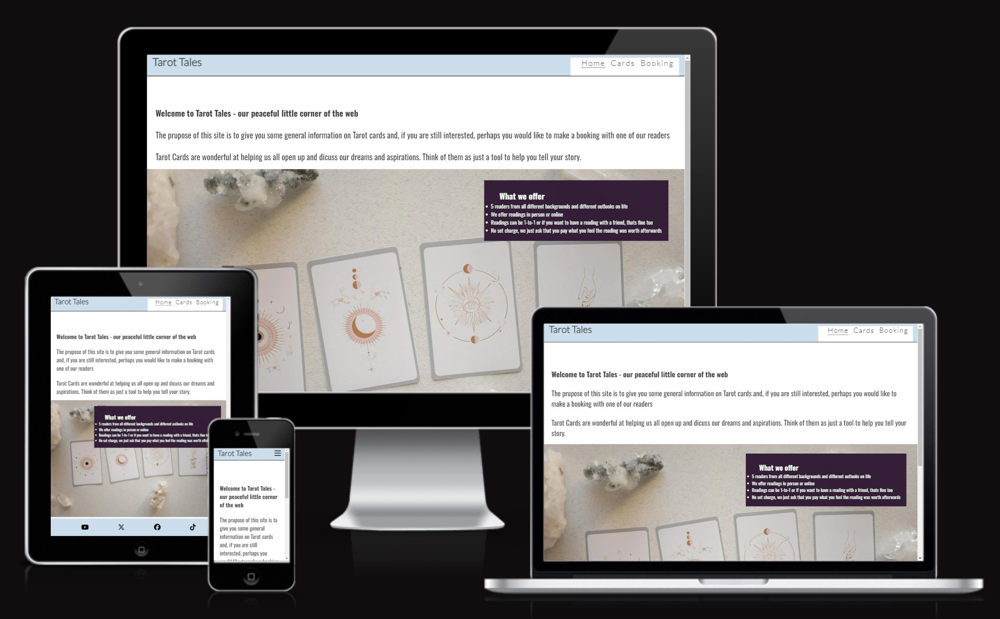
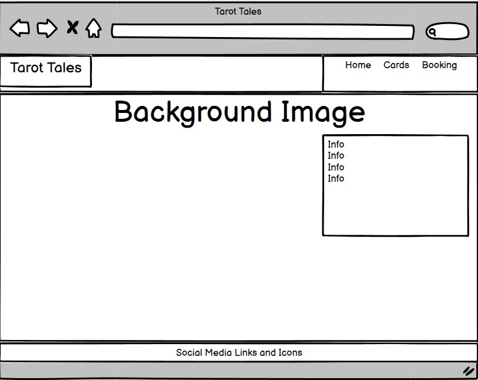
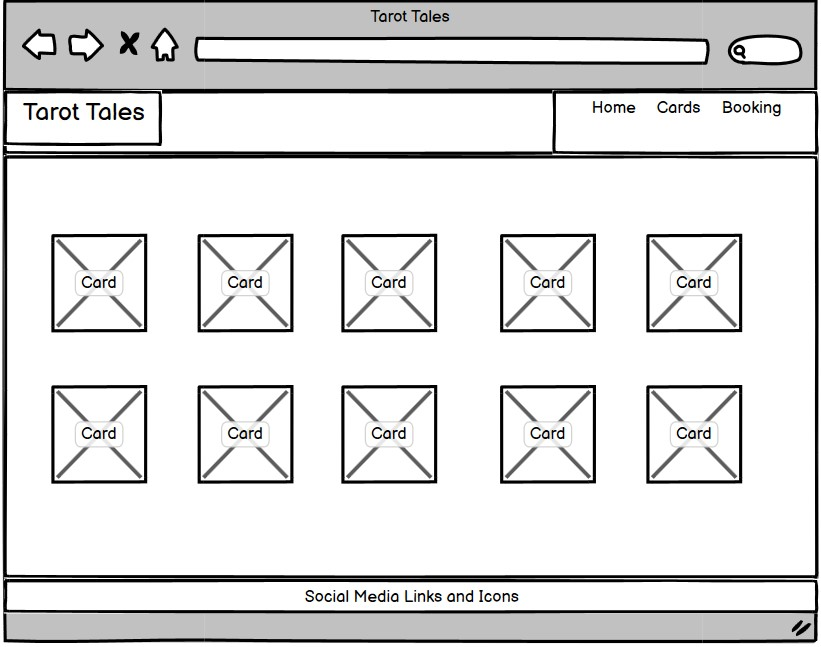
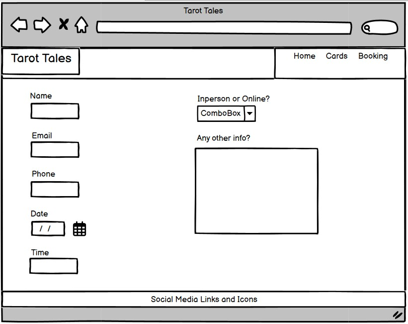
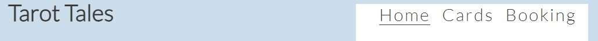
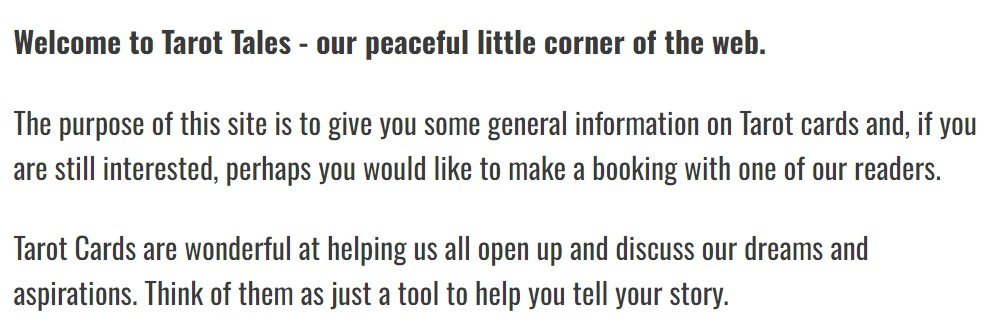
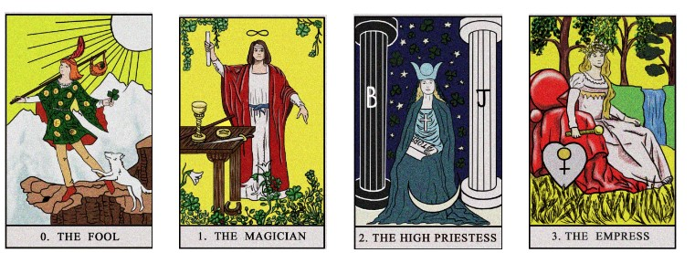
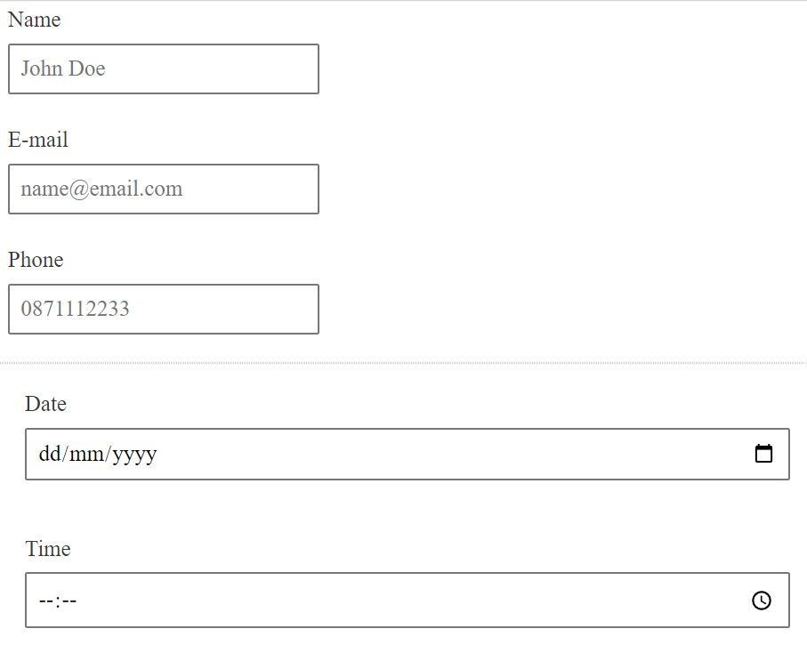

# Tarot Tales
(adapted from Love Running tutorial readme)

This site is designed to give users an overview of the services provided by Tarot Tales. We offer both in person and online readings with experienced and friendly staff members. There is a bookings page to contact us directly and make an appointment

## Design

### Screen Display Mockup

  - 
  From https://ui.dev/amiresponsive

### Wireframes

Home page set up. Same Nav Bar and footer for each of the 3 pages

  - 

Cards page to display 10 Tarot Cards
  - 

Booking page for users to submit an appointment
  - 

## Features

### Existing Features

- __Navigation Bar__

  - Featured on all three pages, the full responsive navigation bar includes links to the Home page, Tarot Cards page and Booking page and is identical in each page to allow for easy navigation.
  - This section will allow the user to easily navigate from page to page across all devices without having to revert back to the previous page via the ‘back’ button. 

- __Weclcome Message__

  - Featured on the index/home page, this is the first info that will draw the eye of the user. It gives a short description of the site and tarot cards, themselves

- __Services Provided__

  - Featured on the index/home page, this sets out the services on offer, the types of readings and the price.

- __Tarot Cards__

  - Featured on the Cards page, the first 10 cards of the major Arcana are displayed as pics - starting with The Fool.

- __Booking Form__

  - Featured on the Booking page, users can submit a form to request a booking. Name, Email, Phone, Date, Time and Reading Type information is captured here. There is also a text area to allow the user to supply any other information that they think is relevant.

- __Footer__

  - Featured on all three pages, the footer includes links and logos to four social media platforms - YouTube, X, Facebook and TikTok.

### Features Left to Implement

- Some of the next features to add would include testimonial videos from existing customers and more interactive booking system to display availability of each reader.

## Testing 

- All the links in the nav bar work correctly from each page of the site. 
- The social media links in the footer open to the correct page and in seperate browser.
- For the bookings page, validation is in place after the user presses the "Book a Reading" button to check that al required fields are populated and in the correct format (in the case of Email). A prompt is displayed to to user next to the field that needs attention.
- As this website is a course project, the user information is saved to any database but a Code Institute confirmation page is displayed to confirm the user info was captured. 

Media Queries are used to display on different screen sizes. Different back ground image is used for mobile than tablet or above. Also, the burger menu is used for mobile view with standard nav bar used for other screens. These were tested using the Responsive feature within Chrome DevTools.

Section tags need to have a H2 to H6 tag inside them. This was highlight in HTMl Validator.

Last minute bugs that delayed submission were incorrect paths for image files (for both the site itself and for ReadMe file).
The quality of images on large screens was another issued that needed to be corrected. 

### Validator Testing 

- HTML
  - No errors were returned when passing through the official for each page
    - [W3C validator](https://validator.w3.org/nu/?doc=https%3A%2F%2Fterry-martin.github.io%2Ftarot-tales%2Findex.html)
    - [W3C validator](https://validator.w3.org/nu/?doc=https%3A%2F%2Fterry-martin.github.io%2Ftarot-tales%2Fcards.html)
    - [W3C validator](https://validator.w3.org/nu/?doc=https%3A%2F%2Fterry-martin.github.io%2Ftarot-tales%2Fbooking.html)

- CSS
  - No errors were found on any of the three pages when passing through the official [(Jigsaw) validator](https://jigsaw.w3.org/css-validator/validator?uri=https%3A%2F%2Fterry-martin.github.io%2Ftarot-tales%2Findex.html&profile=css3svg&usermedium=all&warning=1&vextwarning=&lang=en)

## Deployment

- The site was deployed to GitHub pages. The steps to deploy are as follows: 
  - In the GitHub repository, navigate to the Settings tab 
  - From the source section drop-down menu, select the Master Branch
  - Once the master branch has been selected, the page will be automatically refreshed with a detailed ribbon display to indicate the successful deployment. 

The live link can be found here - https://terry-martin.github.io/tarot-tales/booking.html

## Credits

 - Icons: https://fontawesome.com/
 - Fonts: https://fonts.google.com/
 - Nav Bar: Adapted from Love Running tutorial
 - Position text over image: https://www.w3schools.com/howto/howto_css_image_text.asp
 - Form data: https://www.w3schools.com/html/html_forms.asp
 - Photos: https://www.pexels.com/